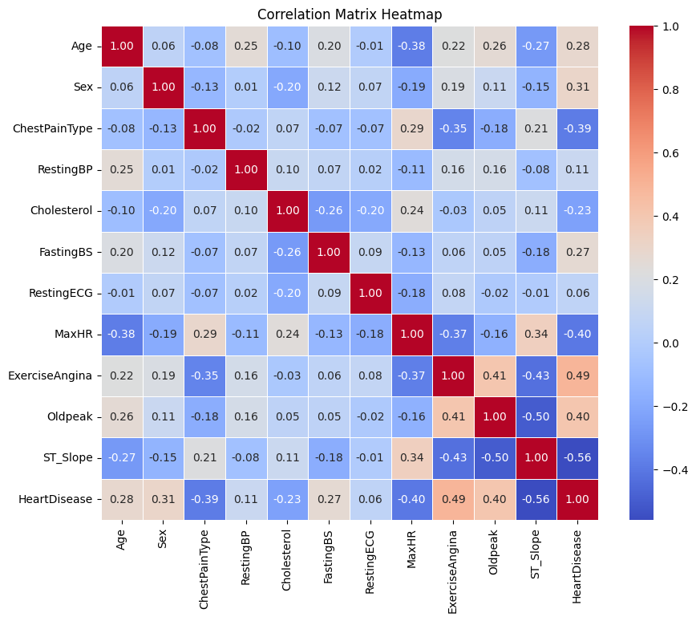
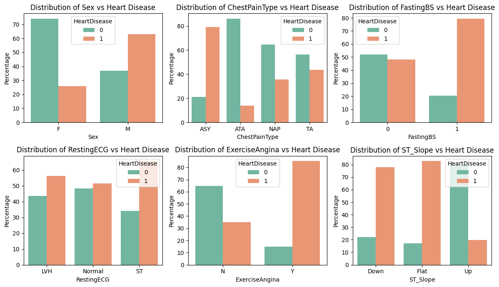
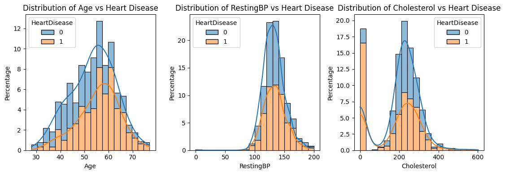
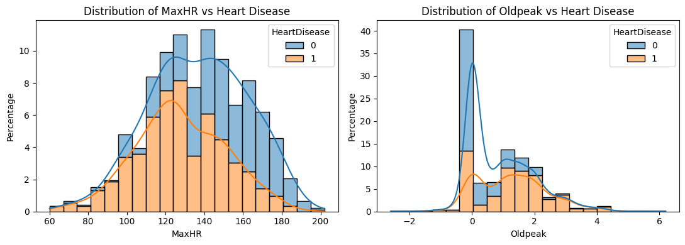
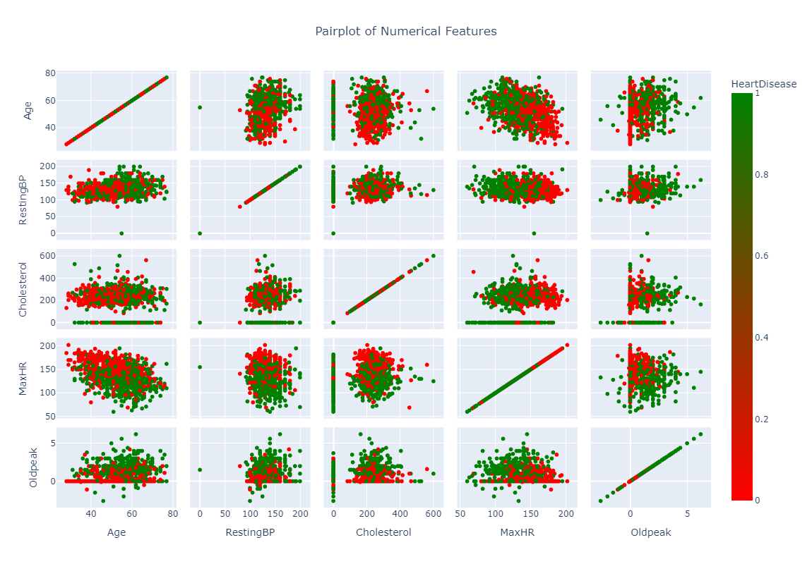
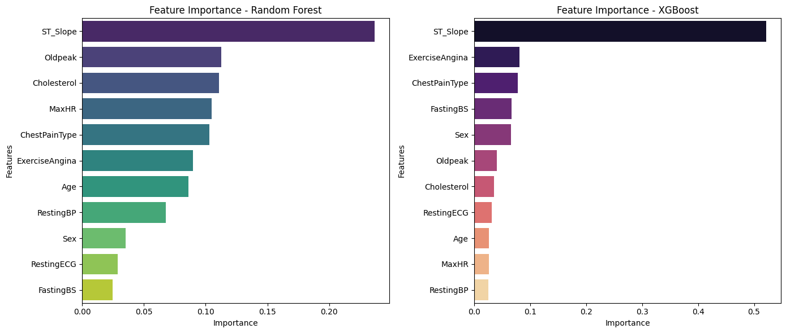
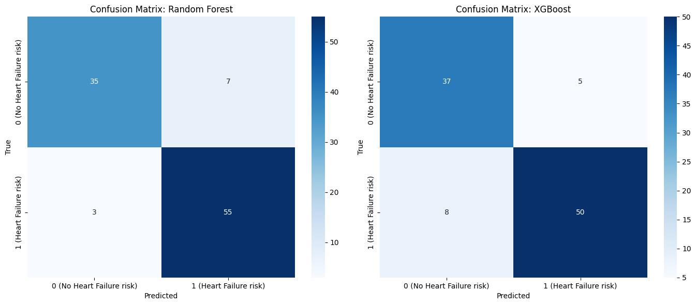
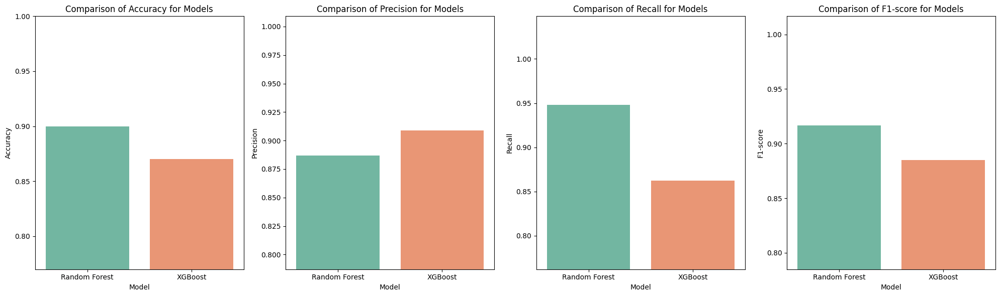

# Heartbeat Sentinel - Decoding and Predicting Heart Failure

Cardiovascular diseases (CVDs) simply Heart disease remain one of the leading causes of mortality globally, underscoring the importance of early diagnosis and effective risk prediction strategies. This project aims on predicting wheather a person is havig a heart failure risk or not. Using historical data, the project employs machine learning techniques, specifically two models are used (a) Random Forest Model and (b) XGBoost Model trained on a diverse dataset, incorporating features such as age, gender, cholesterol levels, blood pressure, glucose levels, and other clinical variables. The feature set is prepared by excluding the target variables, and the model is trained on the remaining features. The performance of the models are presented as confusion matrix and are evaluated on the metrices like Accuracy, precision, Recall, F1 score  and ROC/AUC for both models. This approach provides a robust way to predict heart risk, which in turn provides valuable insights for medical professionals, facilitating early intervention and personalized treatment strategies to mitigate heart disease risks.

## Exploratory Data Analysis with Visualisation

### Figure 01. Correlation Matrix Heatmap

### Figure 02. Histogram of Categorical Data

### Figure 03. Histogram of Numerical Data

### Figure 04. Scatter matrix of Numerical Dta

## Feature selection and training
### Figure 05. Significance of features for (a) Random Forest Model, (b) XGBoost Model

## Classification and Evaluation 

### Figure 06. Confusion Matrix (a) Random Forest Model, (b) XGBoost Model

### Figure 07. Comaprison of (a) Accuracy, (b) precision, (c) Recall, (d) F1 score for both model

### Figure 08. Comaprison of (a) Receiver Operating Characteristic (ROC), (b) Area Under curve (AUC)

## Result and Discussion
Cardiovascular diseases (CVDs) remain a significant global health challenge, necessitating innovative approaches for early diagnosis and risk prediction. In this project, we successfully developed and implemented machine learning models to predict the risk of heart failure using historical data and clinical variables. By employing Random Forest and XGBoost models, we leveraged advanced algorithms to provide accurate and reliable predictions, contributing to the growing field of data-driven healthcare.

**Strengths**:
- Machine learning models like Random Forest and XGBoost are capable of capturing complex non-linear relationships in data, which is critical in medical applications.
- The inclusion of clinically relevant variables ensures the models remain interpretable and useful in real-world healthcare settings.

**Limitations**:
- The dataset size and quality directly impact model performance. Any bias or missing data in the training set can lead to skewed predictions.
- Although the models performed well, their predictive power depends on the availability of accurate input features during deployment.
- The models are not a substitute for clinical diagnosis but should be used as a decision-support tool alongside clinical judgment.

## Conclusion
This project underscores the potential of machine learning in healthcare, particularly in predicting heart failure risk. By leveraging models like Random Forest and XGBoost, we canoffer a reliable approach for early risk identification in future, paving the way for personalized medicine and better management of cardiovascular diseases. Despite the limitations, the outcomes of this study provide a strong foundation for further research and application, contributing to the broader goal of reducing CVD-related morbidity and mortality.

## Future Work:
* Further refinement of the models is recommended, including exploring other advanced machine learning techniques, such as neural networks or ensemble learning approaches.
* Expanding the dataset to include more diverse populations and additional clinical parameters could enhance model generalizability.
* Integration of these models into real-time clinical systems could provide immediate risk assessments, enabling proactive healthcare interventions.

#### If want to know more about this project there are python Notebook file, Project Paper and all other resources included in same repository.
#### Feel free to reach out, I'm open to engaging in meaningful conversations and exchanging ideas on these areas. I welcome the chance to explore new insights, collaborate on projects, and contribute to ongoing discussions in these fields.
