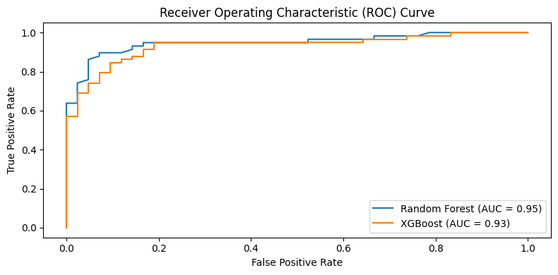

# Heartbeat Sentinel - Decoding and Predicting Heart Failure

Cardiovascular diseases (CVDs) simply Heart disease remain one of the leading causes of mortality globally, underscoring the importance of early diagnosis and effective risk prediction strategies. This project aims on predicting wheather a person is havig a heart failure risk or not. Using historical data, the project employs machine learning techniques, specifically two models are used (a) Random Forest Model and (b) XGBoost Model trained on a diverse dataset, incorporating features such as age, gender, cholesterol levels, blood pressure, glucose levels, and other clinical variables. The feature set is prepared by excluding the target variables, and the model is trained on the remaining features. The performance of the models are presented as confusion matrix and are evaluated on the metrices like Accuracy, precision, Recall, F1 score  and ROC/AUC for both models. This approach provides a robust way to predict heart risk, which in turn provides valuable insights for medical professionals, facilitating early intervention and personalized treatment strategies to mitigate heart disease risks.

## Exploratory Data Analysis with Visualisation

### Figure 01. Correlation Matrix Heatmap

### Figure 02. Histogram of Categorical Data

### Figure 03. Histogram of Numerical Data

### Figure 04. Scatter matrix of Numerical Dta

## Feature selection and training
### Figure 05. Significance of features for (a) Random Forest Model, (b) XGBoost Model

## Classification and Evaluation 

### Figure 06. Confusion Matrix (a) Random Forest Model, (b) XGBoost Model

### Figure 07. Comaprison of (a) Accuracy, (b) precision, (c) Recall, (d) F1 score for both model

### Figure 08. Comaprison of (a) Receiver Operating Characteristic (ROC), (b) Area Under curve (AUC)

## Conclusion and Discussion

